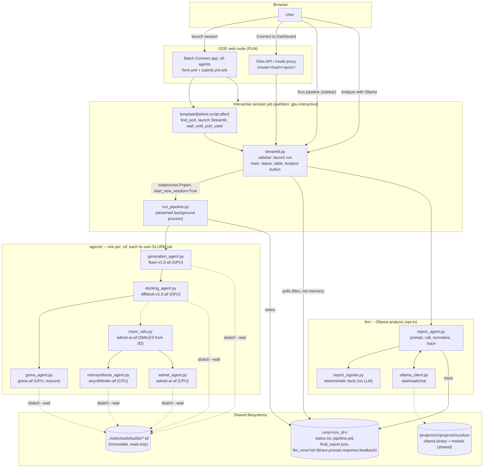

# Architecture: sif-agents

## Components and hosts



## Control flow of one full run

```mermaid
sequenceDiagram
  actor U as User
  participant S as streamlit.py
  participant P as run_pipeline.py
  participant A as agents/*.py
  participant Q as Slurm
  participant L as llm/report_agent.py
  participant O as Ollama

  U->>S: click "Run pipeline"
  S->>S: write status.txt=RUNNING, pipeline.pid
  S->>P: subprocess.Popen(start_new_session=True)
  Note over S,P: detached -- survives a page reload;<br/>S never holds a process handle, only reads files back

  P->>A: generation_agent.run(...)
  A->>Q: sbatch --wait (flowr-v1.0.sif, GPU)
  Q-->>A: samples_*.sdf
  A-->>P: generated_sdf

  P->>A: docking_agent.run(...)
  A->>Q: sbatch --wait (diffdock-v1.0.sif, GPU)
  Q-->>A: rank1_confidence*.sdf per molecule
  A-->>P: best_poses

  P->>A: gnina_agent.run(...)
  A->>Q: sbatch --wait (gnina.sif, GPU, --minimize)
  Q-->>A: CNNscore/CNNaffinity per molecule
  A-->>P: rescored

  P->>A: chem_utils.smiles_from_sdf_files(...)
  A->>Q: apptainer exec (admet-ai.sif, RDKit one-off)
  A-->>P: smiles.csv

  P->>A: retrosynthesis_agent.run(...)
  A->>Q: sbatch --wait (aizynthfinder.sif, CPU)
  A-->>P: is_solved per molecule

  P->>A: admet_agent.run(...)
  A->>Q: sbatch --wait (admet-ai.sif, CPU)
  A-->>P: ADMET properties per molecule

  P->>P: write final_report.json, exit_code.txt
  U->>S: reload page / click Analyze
  S->>S: read final_report.json from disk
  S->>L: report_agent.analyze(report, run_dir)
  L->>L: report_signals.extract_signals (grounded facts)
  L->>O: ensure running, POST /api/chat (findings + report)
  O-->>L: JSON {summary, top_candidates, concerns}
  L->>S: write runs/<id>/llm_runs/<ts>/{trace,prompt,response}.json
  S->>U: render summary + 👍/👎
```

## Design principles carried over from `auxilium-analyze`

1. **Files are the message bus.** Neither `streamlit.py` nor the browser ever
   holds a process handle across a page load; every status transition is a
   file under `runs/<run_id>/` (`status.txt`, `pipeline.pid`, `final_report.json`).
2. **A fact pipeline with a model at the end, not a chatbot.**
   `report_signals.py` computes grounded facts first; `report_agent.py`'s
   prompt tells the model not to contradict them.
3. **Every LLM call writes a trace**, per-run and never overwritten
   (`llm_runs/<UTC>-<pid>/{trace.json,prompt.json,response.txt,feedback.json}`),
   so a bad answer can be attributed to a bad model, a bad prompt, or a fact
   the signals step missed.
4. **One agent, one container, one Slurm job.** Each of the 5 agents wraps
   exactly one `.sif` and submits its own `sbatch --wait` job; no shared
   scheduler, no Celery, no persistent worker pool.
